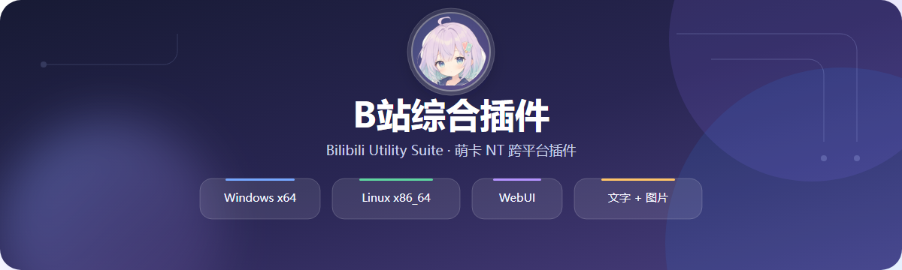

  

  

    
    
    
  

  
<strong>A cross-platform Bilibili feature suite for MoeCard NT</strong>

  
<a href="README.md">简体中文</a> · <a href="https://gitee.com/carlor-official/BilibiliSuite/releases/latest">Download</a> · <a href="https://gitee.com/carlor-official/BilibiliSuite/issues">Issues</a>

---

## Overview

Bilibili Suite connects to MoeCard NT through a forward WebSocket service and provides Bilibili queries, subscriptions, link parsing, notifications, and locally rendered image cards for group and private chats.

Windows and Linux share the same browser-based administration UI. The plugin sends plain text and image messages only and does not depend on Markdown support.

> This repository is the official release and documentation channel. It does not publish the plugin's core source code, and a valid authorization is required to use plugin features.

## Highlights

- Dynamic, live, guard, gift, live-event, bangumi, decoration, and collection notifications
- User, live room, latest dynamic, latest video, decoration, and fan medal queries
- Bilibili user, live room, dynamic, video, and workshop link parsing
- Plain-text and locally rendered image-card modes
- Independent Bilibili QR login, authorization, credentials, subscriptions, and data for every QQ account
- Bark notifications for iOS
- Per-bot and per-group WebUI configuration, 18 customizable message templates, runtime logs, and signed online updates

Send `哔哩菜单` in chat to open the command menu.

## Supported Platforms

| Platform | Package | Requirements |
| --- | --- | --- |
| Windows x64 | `BilibiliSuite-*-windows-x86_64.zip` | Windows x86_64 and a modern browser |
| Linux x86_64 | `BilibiliSuite-*-linux-x86_64.tar.gz` | glibc 2.35+, Ubuntu 22.04/24.04 recommended |

Windows and Linux packages are not interchangeable.

## Quick Start

1. Download the package for your platform from [Gitee Releases](https://gitee.com/carlor-official/BilibiliSuite/releases/latest).
2. On Windows, extract the ZIP and run `BilibiliSuite.exe`. On Linux, extract the archive and run `sudo ./install.sh`.
3. Complete the first-run WebUI port and management-token setup. The default port is `18080`.
4. Open the displayed WebUI address and configure the MoeCard NT host, port, and framework token.
5. Add plugin-owner QQ numbers, verify each bot's authorization status, and configure features per bot and group.
6. Send `扫码登录账号` in chat to complete an independent Bilibili QR login before using queries and subscriptions.

## Custom Message Templates

The WebUI provides 18 templates for live notifications and summaries, live events, dynamics and videos, bangumi updates, profile and live-room queries, decorations, and collections. Each bot has an independent global template set, while individual groups may override it. Variables are validated against a per-template allowlist, image variables remain real image messages, and no Markdown is generated.

## Isolation and Reliability

- Every bot QQ has independent authorization, heartbeat, storage, credentials, and subscriptions.
- An unauthorized QQ is disabled independently and never shuts down the whole process.
- One bot's authorization or data cannot be reused by another bot.
- Temporary authorization-service instability does not stop the plugin after a single failed heartbeat.
- WebUI logs redact tokens, cookies, and common sensitive values.

## Signed Updates

The WebUI checks the latest Gitee Release and offers an update only when the remote version is newer. Platform-specific packages and their `.sig` files are downloaded together and installed only after signature verification succeeds.

## Security Notice

Release packages contain signed binaries, runtime libraries, and documentation only. They do not include core plugin source code, signing keys, user configuration, or business data. Keep `config.json`, `web-admin.json`, `admin.token`, and plugin data directories private.

## Support

- Downloads and changelog: [Releases](https://gitee.com/carlor-official/BilibiliSuite/releases)
- Bug reports and suggestions: [Issues](https://gitee.com/carlor-official/BilibiliSuite/issues)

No open-source license is currently granted for the plugin's core implementation. Download official packages only from this repository's Releases page.
